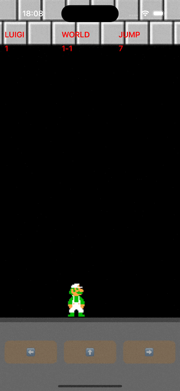

# App Super Mario
 Aplicativo exibe a tela do tradicional game `Super Mario` onde a cada do pulo do personagem Mario ou Luigi (conforme consumo de tela da web api) ele contabiliza na label do scorre do game.
 
  ### Projeto desenvolvido ultilizando:
  - [x] Swift 5.
  - [x] VIPER.
  - [x] View Code - `UIKit`.
  - [x] Animation.
  - [x] Consumo webApi usando `NSURL`.
  - [x] Persistência local usando `CoreData`.
  - [x] Ultiliza a abordagem `SDUI` (Server Driven UI) para montagem de elementos da tela do game.
  - [x] Os arquivos `json` estão anexados no projeto dentro da pasta `Mock`, e tem que subir eles para um site como o `Mocky` (https://designer.mocky.io), para então fazer o consumo dentro do app.
  
 ## Print Screen :foggy:
 
|  |  |
|:---:|:---:|
| Mario | Luigi |

